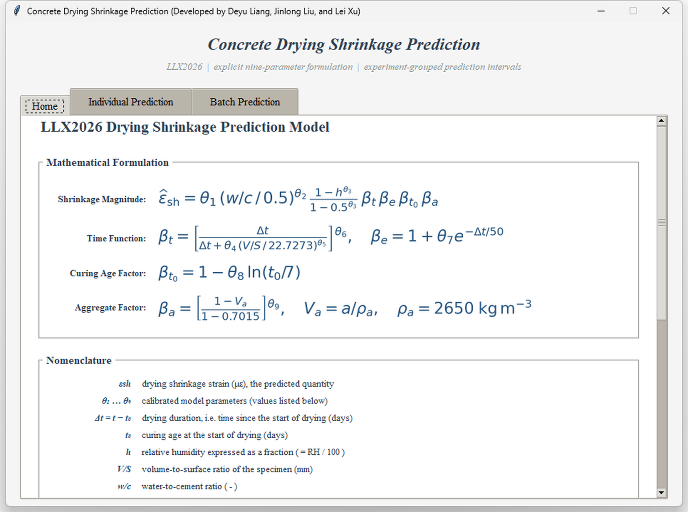
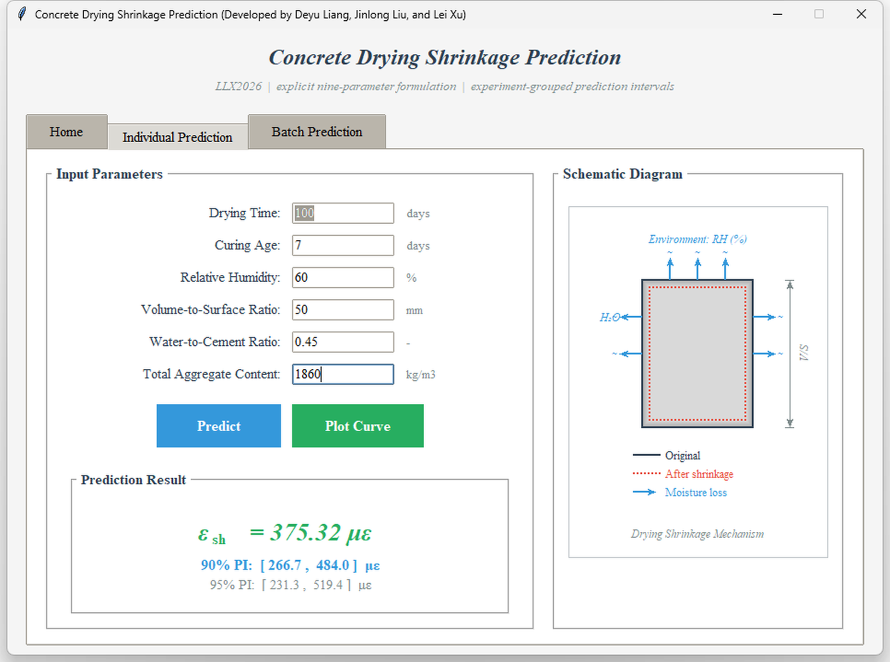
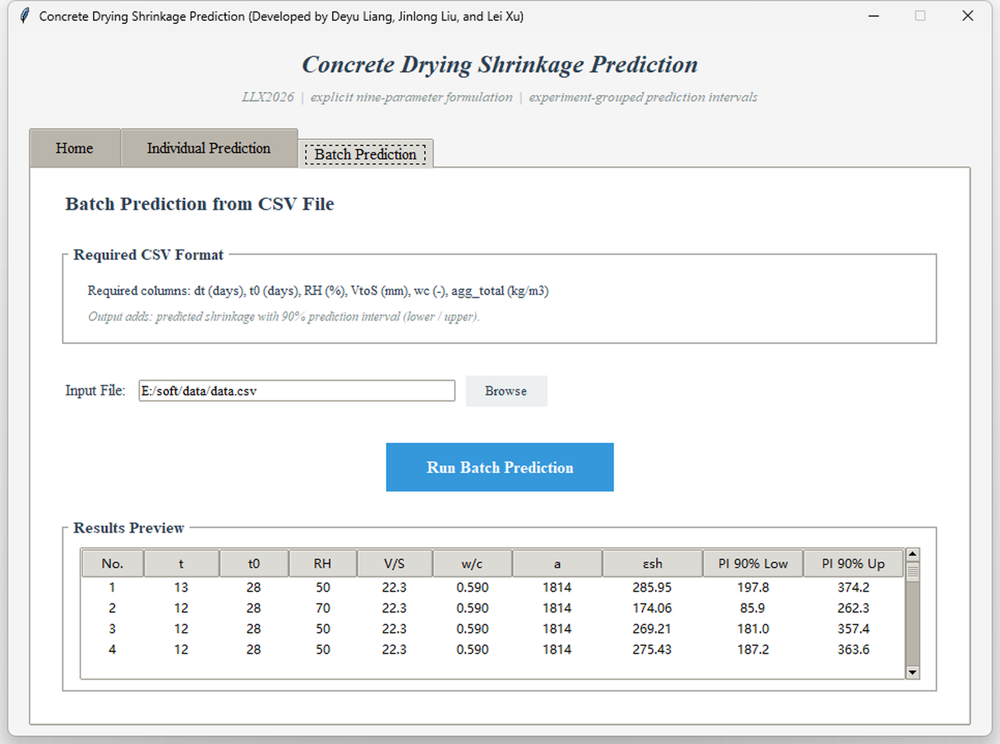
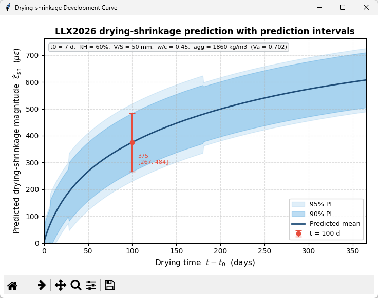

# LLX2026 Concrete Drying Shrinkage Prediction

**A Python desktop application for concrete drying-shrinkage prediction using an explicit nine-parameter formulation and empirical prediction intervals**

[](LICENSE)
[](https://www.python.org/)
[](CHANGELOG.md)
[](https://github.com/hunter137/LLX2026-drying-shrinkage-predictor/actions/workflows/tests.yml)
[](https://zenodo.org/records/21614015)

---

## Overview

LLX2026 is a desktop program for evaluating the magnitude of concrete drying
shrinkage from six user inputs: drying duration, curing age, relative humidity,
volume-to-surface ratio, water-to-cement ratio, and total aggregate content.
The program provides an individual prediction, empirical 90% and 95%
prediction intervals, CSV batch processing, and a shrinkage-development curve.

The numerical model is separated from the graphical interface so that the same
calculation can also be called from Python scripts and notebooks. The original
interface layout, displayed equations, nomenclature, input fields, and result
presentation are retained in Version 1.

> **Research status:** The associated manuscript, *Metaheuristic-Based
> Parameter Calibration of Empirical Concrete Drying Shrinkage Models:
> Systematic Evaluation and Improved Formulation*, has not been accepted or
> published. This repository is a software release and does not imply journal
> acceptance or peer-review endorsement.

---

## Screenshots

**Model Formulation** — the Home tab presents the complete LLX2026 equation,
component factors, nomenclature, calibrated coefficients, and interval notes.



**Individual Prediction** — enter one set of material, environmental, and time
parameters to obtain the predicted shrinkage magnitude and its 90% and 95%
empirical prediction intervals.



**Batch Prediction** — load a CSV file, calculate all records, preview the
results in the interface, and save the appended prediction columns.



**Development Curve** — plot the predicted shrinkage history together with
the 90% and 95% interval bands and the selected-time result.



---

## Features

- Original three-tab desktop interface: Home, Individual Prediction, and Batch Prediction
- Explicit nine-parameter concrete drying-shrinkage formulation
- Individual point prediction in microstrain (με)
- Drying-age-grouped 90% and 95% empirical prediction intervals
- CSV batch prediction with a 90% interval preview and CSV export
- Development-curve plotting with both interval bands
- Reusable Python API for single-record, vectorised, and DataFrame calculations
- Separated model, batch-processing, plotting, and GUI modules
- Input validation for numerical and physical-domain errors
- Automated tests for the reference calculation, intervals, CSV processing, and plotting

---

## Installation

### Requirements

- Python 3.8 or later
- Tkinter
- NumPy
- pandas
- Pillow
- Matplotlib

### Option 1 — conda

```bash
git clone https://github.com/hunter137/LLX2026-drying-shrinkage-predictor.git
cd LLX2026-drying-shrinkage-predictor
conda env create -f environment.yml
conda activate llx2026
python main.py
```

### Option 2 — pip

```bash
git clone https://github.com/hunter137/LLX2026-drying-shrinkage-predictor.git
cd LLX2026-drying-shrinkage-predictor
python -m pip install -e .
python main.py
```

---

## Usage

### Individual Prediction

1. Run `python main.py` and open the **Individual Prediction** tab.
2. Enter the six input parameters in the displayed units.
3. Click **Predict** to calculate the shrinkage magnitude and prediction intervals.
4. Click **Plot Curve** to inspect the development with drying time.

### Batch Prediction

1. Open the **Batch Prediction** tab.
2. Select a CSV file containing the six required columns.
3. Click **Run Batch Prediction**.
4. Review the results table, click **Export Results**, and choose a location for the output CSV file.

The example file [`examples/batch_input.csv`](examples/batch_input.csv) shows
the required format:

```csv
dt,t0,RH,VtoS,wc,agg_total
7,7,50,22.7,0.50,1860
28,7,60,50.0,0.45,1860
```

### Python API

```python
from llx2026 import ShrinkageInputs, evaluate

inputs = ShrinkageInputs(
    drying_time=100,
    curing_age=7,
    relative_humidity=60,
    volume_to_surface=50,
    water_cement_ratio=0.45,
    aggregate_content=1860,
)

result = evaluate(inputs)
print(result.value)
print(result.pi90_lower, result.pi90_upper)
print(result.pi95_lower, result.pi95_upper)
```

---

## Input Parameters

| Parameter | Symbol / CSV column | Unit | Description |
|---|---|---|---|
| Drying duration | Δt / `dt` | days | Time elapsed since the start of drying |
| Curing age | t₀ / `t0` | days | Concrete age at the start of drying |
| Relative humidity | RH / `RH` | % | Ambient relative humidity |
| Volume-to-surface ratio | V/S / `VtoS` | mm | Specimen volume divided by drying surface area |
| Water-to-cement ratio | w/c / `wc` | — | Concrete water-to-cement ratio |
| Total aggregate content | a / `agg_total` | kg/m³ | Total aggregate mass per unit concrete volume |

The desktop batch interface appends the point prediction and 90% lower and
upper limits. The reusable `predict_dataframe` and `predict_csv` Python helpers
also append the 95% limits. Existing input columns are retained.

---

## Project Structure

```text
LLX2026-drying-shrinkage-predictor/
├── main.py                  # Application entry point
├── requirements.txt         # pip dependencies
├── environment.yml          # conda environment specification
├── pyproject.toml           # Package and build metadata
├── LICENSE                  # MIT License
├── README.md                # Project documentation
├── CITATION.cff             # Machine-readable citation metadata
├── CHANGELOG.md             # Version history
├── MODEL_CARD.md             # Intended use and limitations
├── data/
│   └── README.md            # Calibration-data availability note
├── examples/
│   └── batch_input.csv      # Example CSV input format
├── docs/
│   └── screenshots/         # Four interface screenshots
├── src/llx2026/
│   ├── gui.py               # Original interface and GUI event handling
│   ├── model.py             # Numerical model and prediction intervals
│   ├── batch.py             # CSV and DataFrame processing
│   ├── plotting.py          # Reusable development-curve plotting
│   └── __init__.py          # Public Python API
└── tests/
    ├── test_model.py        # Model and interval checks
    ├── test_batch.py        # CSV and DataFrame checks
    └── test_plotting.py     # Plot-generation checks
```

---

## Running Tests

```bash
python -m pip install -e .
python -m unittest discover -s tests -v
```

---

## Scope and Limitations

- The model is intended for research and educational calculations of concrete drying-shrinkage magnitude.
- The current formulation was calibrated using records derived from the Northwestern University concrete creep and shrinkage database.
- The original calibration database is not redistributed in this repository. The file in `examples/` demonstrates format only and is not a validation dataset.
- Aggregate volume fraction is estimated from total aggregate content using a nominal aggregate density of 2650 kg/m³ unless a measured value is supplied through the Python API.
- The displayed intervals are empirical record-level prediction intervals grouped by drying age. They are not confidence intervals for the mean and are not engineering safety factors.
- Predictions outside the calibration domain require additional scrutiny.
- The software is not a design code and must not be used as the sole basis for structural design, safety assessment, or compliance decisions.

See [`MODEL_CARD.md`](MODEL_CARD.md) for additional model-use notes.

---

## Authors

- Deyu Liang — School of Transportation and Surveying Engineering, Shenyang Jianzhu University, Shenyang, China
- Jinlong Liu — School of Civil Engineering, Southeast University, Nanjing, China
- Lei Xu — Laboratory of Construction Materials, École Polytechnique Fédérale de Lausanne, Lausanne, Switzerland

---

## Citation

Until the Zenodo record is published, cite this Version 1 repository as
research software:

```bibtex
@software{liang2026llx2026,
  author  = {Liang, Deyu and Liu, Jinlong and Xu, Lei},
  title   = {{LLX2026 Concrete Drying Shrinkage Prediction}},
  year    = {2026},
  version = {1.0.0},
  url     = {https://github.com/hunter137/LLX2026-drying-shrinkage-predictor},
}
```

The DOI `10.5281/zenodo.21614015` has been reserved in a Zenodo draft, but the
record has not yet been published and the DOI is not active. The planned Zenodo
record address is:

[https://zenodo.org/records/21614015](https://zenodo.org/records/21614015)

The citation metadata can be updated after the Zenodo record becomes public.

---

## License

This project is licensed under the MIT License — see the [LICENSE](LICENSE)
file for details.
